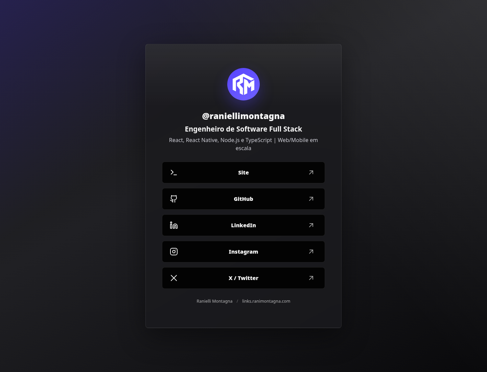
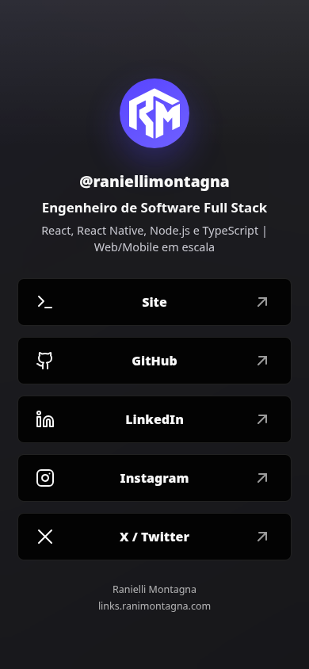

<div align="center">
  <picture>
    <source media="(prefers-color-scheme: dark)" srcset="./public/logo/white.svg" />
    
  </picture>

  <h1>links.ranimontagna.com</h1>

  <p>
    Uma página de links pessoal, estática e first-party, criada com Astro para substituir o Linktree nos perfis sociais.
  </p>

  <p>
    
    
    
    
  </p>
</div>

## Preview

<table>
  <tr>
    <td width="72%" valign="top">
      
    </td>
    <td width="28%" valign="top">
      
    </td>
  </tr>
</table>

## Sobre

Este repositório contém a versão própria do meu agregador de links pessoal para `links.ranimontagna.com`.

A proposta é manter a clareza de uma página estilo Linktree, mas com domínio próprio, identidade visual do portfólio e controle total sobre conteúdo, performance e deploy.

## Destaques

- Página única, estática e sem runtime backend.
- Construída com Astro e TypeScript.
- Visual mobile-first, otimizado para bios de redes sociais.
- Assets da marca RM copiados do portfólio principal.
- Links e copy mantidos em dados tipados.
- Metadata, Open Graph, Twitter Card e JSON-LD configurados.
- Testes de sanidade para links públicos e metadata.

## Stack

| Camada | Tecnologia |
| --- | --- |
| Framework | Astro |
| Linguagem | TypeScript |
| Estilo | CSS global |
| Testes | Vitest |
| Package manager | pnpm |
| Output | Static site |

## Rodando Localmente

Pré-requisitos:

- Node.js `>=22.12.0`
- pnpm `11.x`

Instale as dependências:

```bash
pnpm install
```

Inicie o servidor de desenvolvimento:

```bash
pnpm dev
```

O site fica disponível em:

```text
http://localhost:4321
```

## Scripts

| Comando | Descrição |
| --- | --- |
| `pnpm dev` | Inicia o servidor local do Astro |
| `pnpm build` | Gera a versão estática em `dist/` |
| `pnpm preview` | Serve o build localmente |
| `pnpm check` | Executa validação do Astro e TypeScript |
| `pnpm test` | Executa os testes com Vitest |

## Estrutura

```text
.
├── docs/
│   ├── assets/                 # Screenshots usados no README
│   └── superpowers/            # Spec e plano de implementação
├── public/
│   ├── logo/                   # Logos RM copiadas do portfólio
│   └── og-image.png
├── src/
│   ├── data/profile.ts         # Identidade, copy e links públicos
│   ├── lib/metadata.ts         # Metadata centralizada
│   ├── pages/index.astro       # Página principal
│   └── styles/global.css       # Layout e visual system
└── package.json
```

## Conteúdo

Os links principais ficam em:

[src/data/profile.ts](./src/data/profile.ts)

O arquivo contém:

- Nome e handle.
- Posicionamento técnico.
- Lista ordenada de links públicos.
- Labels acessíveis para navegação assistiva.

## Deploy

URL alvo de produção:

```text
https://links.ranimontagna.com
```

O projeto gera output estático e pode ser publicado em Vercel, Cloudflare Pages, Netlify ou qualquer host de arquivos estáticos.

Build de produção:

```bash
pnpm build
```

Diretório gerado:

```text
dist/
```

## Qualidade

Antes de publicar alterações:

```bash
pnpm test
pnpm check
pnpm build
```

Esses comandos validam os dados públicos, metadata, tipos Astro/TypeScript e o build estático.
