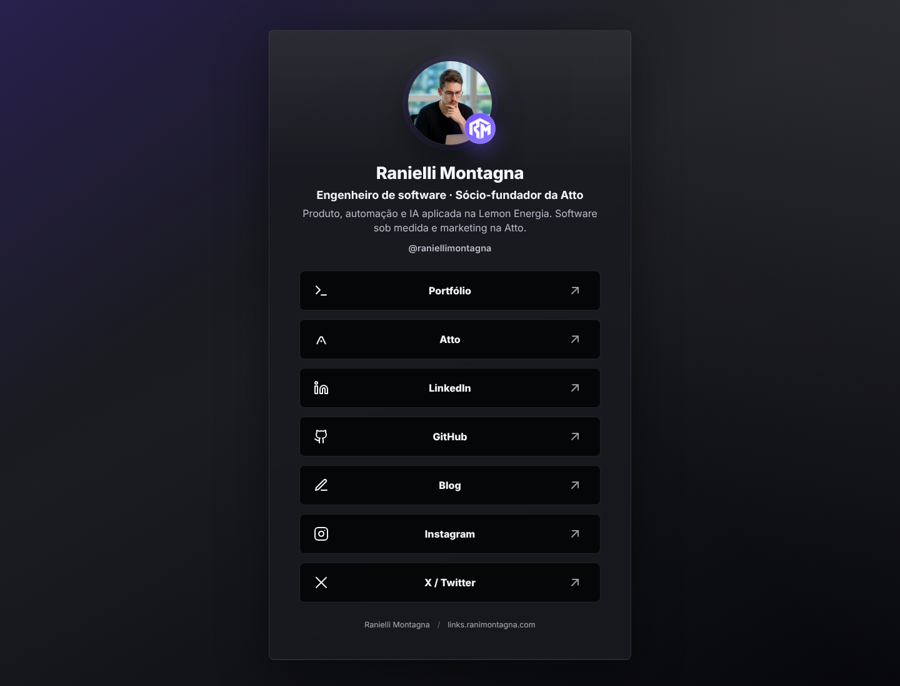

<div align="center">
  <picture>
    <source media="(prefers-color-scheme: dark)" srcset="./public/logo/white.svg" />
    
  </picture>

  <h1>links.ranimontagna.com</h1>

  <p>A static, first-party links page built with Astro that replaces Linktree in Ranielli Montagna's social profiles.</p>

  <p>
    <a href="LICENSE"></a>
    
    
  </p>

  <p><strong>Live:</strong> <a href="https://links.ranimontagna.com">links.ranimontagna.com</a></p>
</div>

## Preview

<table>
  <tr>
    <td width="72%" valign="top">
      
    </td>
    <td width="28%" valign="top">
      
    </td>
  </tr>
</table>

## About

The page keeps the clarity of a Linktree-style profile while running on its own domain, with the portfolio's visual identity and full control over content, performance and deploys.

## Features

- One static page with no backend. The only client script is a ~1 KB loader that fetches Sentry once the page is idle.
- Mobile-first layout tuned for traffic from social media bios.
- Links and copy kept as typed data in a single file.
- `rel="me"` on links to personal profiles.
- Metadata, Open Graph, Twitter Card and JSON-LD.
- Light and dark favicons, plus the RM brand assets from the portfolio.
- Respects `prefers-reduced-motion`.
- Error and performance monitoring with Sentry, kept off the critical path.
- Vitest checks for the public links, metadata and Sentry settings.

## Tech stack

| Layer | Technology |
| --- | --- |
| Framework | Astro (static output) |
| Language | TypeScript |
| Styling | Plain global CSS |
| Tests | Vitest |
| Monitoring | Sentry (`@sentry/browser`, lazy-loaded) |
| Package manager | pnpm |
| Hosting | Vercel |

## Getting started

Prerequisites: Node.js 22.12 or newer and pnpm 11.

```bash
pnpm install
pnpm dev
```

The site runs at `http://localhost:4321`.

## Scripts

| Command | What it does |
| --- | --- |
| `pnpm dev` | Start the Astro dev server |
| `pnpm build` | Build the static site into `dist/` |
| `pnpm preview` | Serve the build locally |
| `pnpm check` | Run Astro and TypeScript checks |
| `pnpm test` | Run the Vitest suite |
| `pnpm test:watch` | Run Vitest in watch mode |

Before publishing a change, run `pnpm test`, `pnpm check` and `pnpm build`.

## Project structure

```text
.
├── docs/
│   ├── assets/                 # README screenshots
│   └── superpowers/            # Design spec and implementation plan
├── public/
│   ├── images/                 # Profile photos
│   ├── logo/                   # RM logos copied from the portfolio
│   └── og-image.png
├── src/
│   ├── data/profile.ts         # Identity, copy and public links
│   ├── lib/metadata.ts         # Centralized metadata
│   ├── lib/sentry-config.ts    # Sentry DSN, release and options (pure)
│   ├── lib/sentry-loader.ts    # Page script: loads Sentry when idle
│   ├── lib/sentry-client.ts    # Lazy chunk: @sentry/browser init
│   ├── pages/index.astro       # The page
│   └── styles/global.css       # Layout and visual system
└── package.json
```

## Editing the links

All content lives in [`src/data/profile.ts`](src/data/profile.ts): name and handle, title and subtitle, and the ordered list of links with their accessible labels. The tests in `src/data/profile.test.ts` pin the link order and the `rel="me"` set, so update them together with the data.

## Monitoring

- **Visits:** Umami, self-hosted at https://analytics.ranimontagna.com (website `links.ranimontagna.com`). Cookieless, deferred, and it only reports from `links.ranimontagna.com`.

Errors and performance go to Sentry, org `raniellimontagna`, project `links-ranimontagna`. The SDK never competes with first paint:

- `src/lib/sentry-loader.ts` is the only page script (about 1 KB gzipped). It waits 2 s, then for the browser to go idle (`requestIdleCallback`, 5 s timeout; 3 s more where it is missing), and only then imports the SDK chunk (`src/lib/sentry-client.ts`). An `error` or `unhandledrejection` before that loads the SDK at once and reports it.
- **Errors:** uncaught errors and unhandled rejections. `ResizeObserver loop` noise is ignored, `sendDefaultPii` is off, and there is no session replay.
- **Performance:** 20% of page loads send a page-load trace with web vitals (LCP, CLS, INP, FCP, TTFB).
- **Tags:** `environment` is `production` for `pnpm build` and `development` for `pnpm dev`. `release` is `links@<package.json version>+<UTC build time yyyyMMddHHmm>`, set at build time in `astro.config.mjs`.
- The DSN is public by design and lives in `src/lib/sentry-config.ts`. Set `PUBLIC_SENTRY_DSN` to override it.

Where to look:

- [Issues](https://raniellimontagna.sentry.io/issues/?project=4512419786457088&environment=production) for errors.
- Insights → Frontend → Web Vitals for page performance, and Explore → Traces for single page loads.

Local `pnpm dev` also reports, tagged `development`, so filter by `environment:production` when reading production data.

## Deploy

`pnpm build` writes a fully static site to `dist/`. Production runs on Vercel, and any static host works.

## License

Released under the [MIT License](LICENSE).
